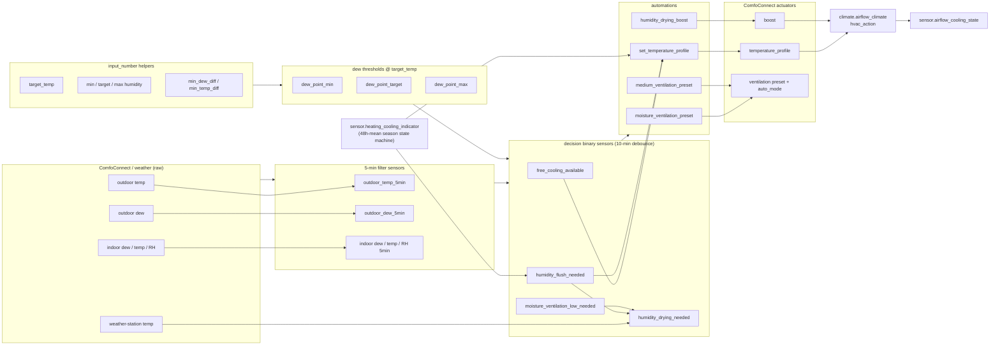
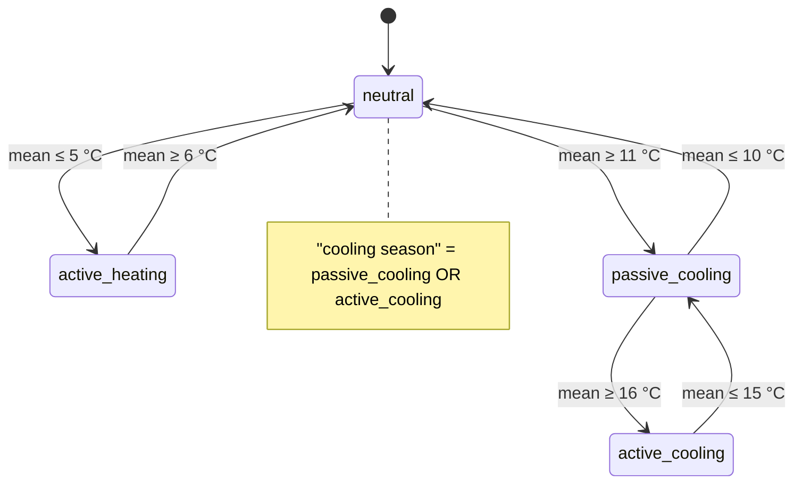
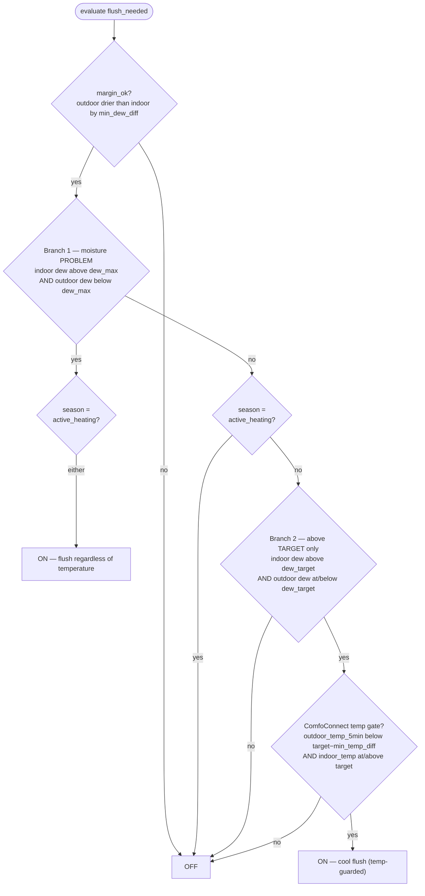
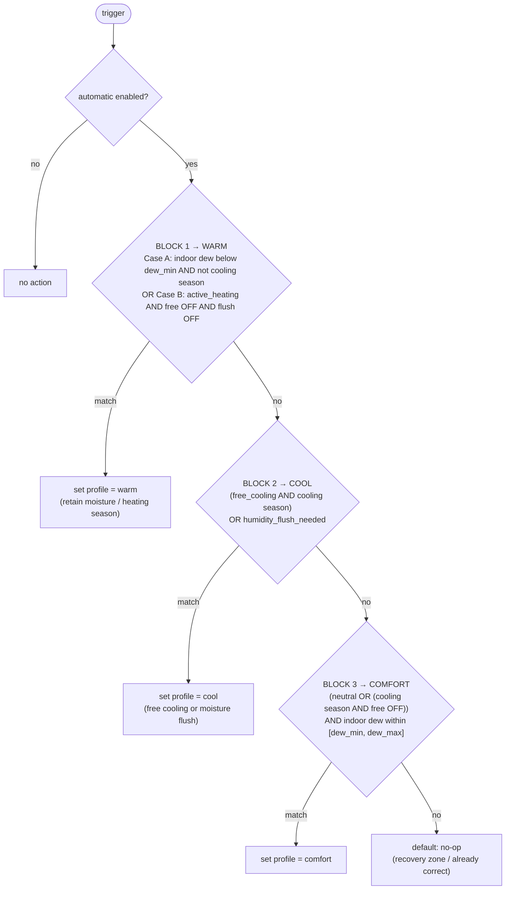
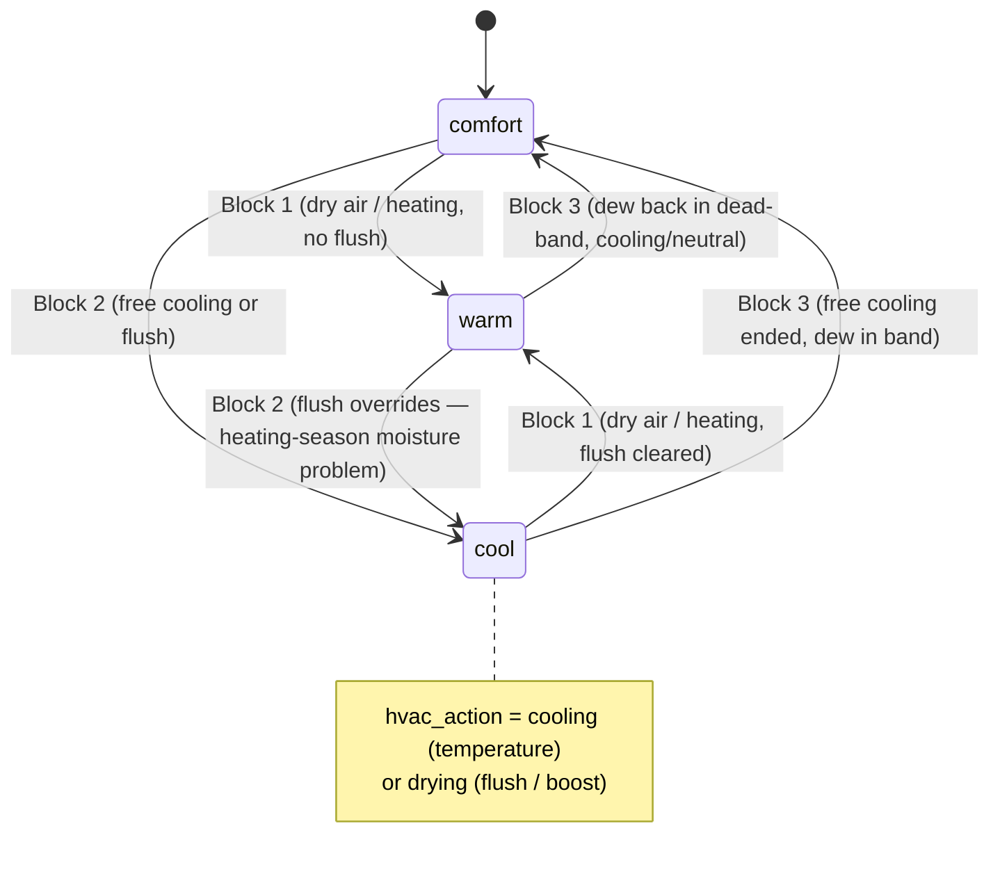
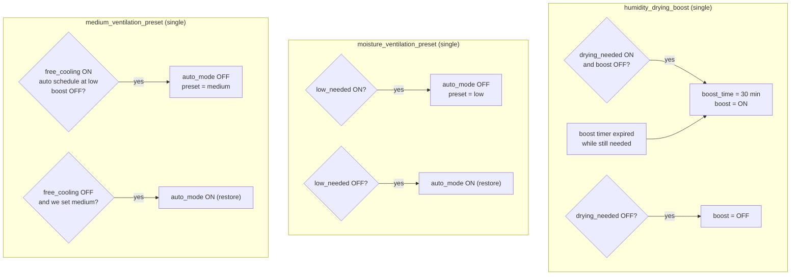
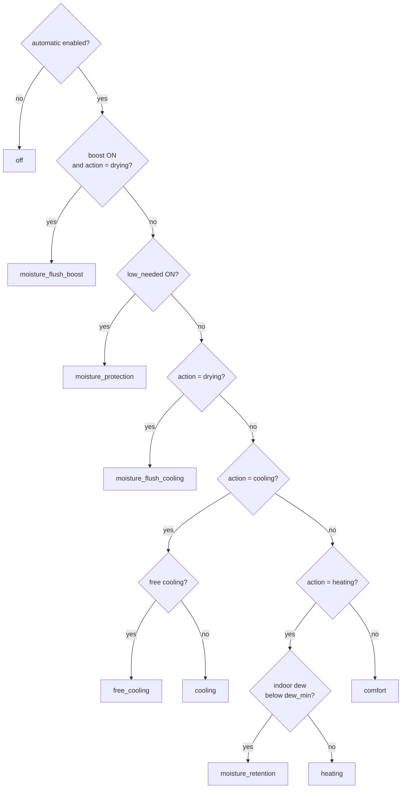

# Airflow Cooling & Humidity — Architecture Design

**Scope:** `packages/airflow_cooling.yaml` (+ `packages/heating_cooling_indicator.yaml`)
**Hardware:** Zehnder ComfoAir Q350 ERV via the ComfoConnect integration
**Status:** Living document — reflects the dew-point + dew-difference-flush design.

> Related plans: [ventilation-profile-automation.md](ventilation-profile-automation.md),
> [airflow-threshold-inputs-humidity-fallback.md](airflow-threshold-inputs-humidity-fallback.md),
> [airflow-bypass-sensor.md](airflow-bypass-sensor.md).

---

## 1. Purpose

Drive the ERV's **temperature profile** (`warm` / `comfort` / `cool`) and **ventilation level**
(auto / low / medium / boost) automatically, to:

1. **Free-cool** the house when outdoor air is cool and dry enough (open the bypass).
2. **Flush indoor moisture** when indoor air is too humid and outdoor air is drier — even when
   the target humidity can't be reached (mould / condensation safety).
3. **Protect** against importing humid outdoor air (reduce ventilation).
4. **Retain moisture** in dry winter air (keep the heat exchanger recovering).

Every humidity decision is expressed in **dew point** (absolute moisture) rather than relative
humidity, because RH thresholds drift as indoor temperature changes. All dew thresholds are
computed at the **target temperature** via the Magnus formula.

---

## 2. Entity inventory

### Inputs — filter sensors (5-min time-weighted average, throttled)

| Entity | Source | Meaning |
|---|---|---|
| `sensor.airflow_min_indoor_dew_5min` | indoor dew aggregate | **indoor moisture** |
| `sensor.airflow_avg_indoor_temp_5min` | indoor temp aggregate | indoor temperature |
| `sensor.airflow_avg_indoor_humidity_5min` | indoor RH aggregate | indoor RH (display) |
| `sensor.airflow_outdoor_dew_5min` | ComfoConnect intake | **outdoor moisture** |
| `sensor.airflow_outdoor_temp_5min` | ComfoConnect intake | **ComfoConnect outdoor temp** |
| `sensor.wheatherstation_outdoor_temperature` | weather station | **real outdoor temp** |
| supply/extract air temp+humidity | ComfoConnect | bypass estimation |

> **Two outdoor temperatures:** the ComfoConnect intake temp (`airflow_outdoor_temp_5min`) gates
> the *cool-profile* logic; the real weather-station temp gates only the *noisy boost*.

### Derived thresholds — dew point at target temp (Magnus)

| Entity | From helper | Used as |
|---|---|---|
| `sensor.airflow_dew_point_min` | `airflow_min_humidity` | dry-air floor (moisture retention) |
| `sensor.airflow_dew_point_target` | `airflow_target_humidity` | comfort target / free-cooling ceiling |
| `sensor.airflow_dew_point_max` | `airflow_max_humidity` | moisture-problem ceiling |

### Decision binary sensors (each debounced `delay_on`/`delay_off` = 10 min)

| Entity | Fires when |
|---|---|
| `binary_sensor.airflow_free_cooling_available` | outdoor cool **and** dry enough to free-cool |
| `binary_sensor.airflow_humidity_flush_needed` | indoor too humid **and** outdoor drier (cool-profile flush) |
| `binary_sensor.airflow_moisture_ventilation_low_needed` | outdoor too humid to import |
| `binary_sensor.airflow_humidity_drying_needed` | flush **and** weather-gated **and** scheduled (boost) |

### Actuators (ComfoConnect)

`select.comfoconnect_pro_temperature_profile` (warm/comfort/cool) ·
`switch.comfoconnect_pro_boost` + `number.comfoconnect_pro_boost_time` ·
`select.comfoconnect_pro_ventilation_preset` (low/medium) + `switch.comfoconnect_pro_auto_mode`.

### Read-only views

`climate.airflow_climate` (hvac_mode + hvac_action) · `sensor.airflow_cooling_state`
(reason-based status) · `sensor.airflow_bypass_estimation`.

---

## 3. Data flow



---

## 4. Season state machine — `sensor.heating_cooling_indicator`

A Schmitt-trigger state machine over the **48-hour mean** outdoor temperature
(`sensor.wheatherstation_outdoor_temperature_48h_mean`). Wide hysteresis bands prevent the
season from flapping day-to-day. This is the **season context** consumed by the profile logic.



---

## 5. Decision sensors

### 5.1 `free_cooling_available` — temperature free cooling

All four must hold (indoor-temp uses a 0.5 °C Schmitt: ON at `target`, stays on to `target − 0.5`):

```
(outdoor_dew + min_dew_diff) < indoor_dew      # outdoor drier by a margin
AND outdoor_dew ≤ dew_point_target             # importing it won't exceed target humidity
AND outdoor_temp_5min < target − min_temp_diff # ComfoConnect intake cool enough
AND indoor_temp ≥ temp_threshold               # room warm enough to want cooling
```

### 5.2 `humidity_flush_needed` — cool-profile moisture flush

Two OR branches, both requiring a real outdoor→indoor moisture **difference**
(`margin_ok = outdoor_dew + min_dew_diff − h < indoor_dew`). A `0.3 °C` `this.state` hysteresis
(`h`) relaxes every boundary while ON.



Key asymmetry:
- **Branch 1** (indoor above max = a real problem) → flushes **regardless of temperature**.
- **Branch 2** (above target only) → flushes **only if** the ComfoConnect temp gate holds, so a
  non-urgent flush never overcools a cool room.
- In **active_heating**, only Branch 1 is allowed.

### 5.3 `moisture_ventilation_low_needed` — humid-import protection

Indoor Schmitt (`indoor_dew ≥ dew_max` ON, stays on to `dew_target`) AND
(`outdoor_dew ≥ dew_threshold` OR `outdoor_dew ≥ indoor_dew`). Broadly the inverse of free
cooling: outdoor air is too humid to bring in.

### 5.4 `humidity_drying_needed` — the noisy boost

```
flush_needed
AND NOT low_active
AND wheatherstation_outdoor_temperature < target_temp   # REAL outdoor, not intake
AND in_schedule                                          # workday / non-workday window
```

The cool-profile flush deliberately **ignores** the schedule and weather station; only the boost
is schedule- and weather-gated.

---

## 6. Temperature profile selection — the core decision

`automation.airflow_cooling_set_temperature_profile` (mode: restart). Triggers: season change,
`free_cooling_available`, `humidity_flush_needed`, indoor-humidity change, HA start. Gated by
`input_boolean.airflow_cooling_automatic_enabled`. It is a `choose:` — **first matching block wins**,
and each block is idempotent (skips if the profile is already correct).



**Precedence note (heating-season flush):** in `active_heating` with indoor dew above max, both
Block 1 Case B (warm) and Block 2 (cool, via flush Branch 1) would match. Block 1 Case B carries a
`flush OFF` guard, so it **yields** — the moisture flush (cool) wins, because relieving a
mould/condensation risk outranks retaining warmth.

### Resulting profile transitions



> Every input to these blocks is a 10-min-debounced sensor (or a wide-hysteresis season state),
> so the profile cannot change more than roughly every 10 minutes.

---

## 7. Actuator automations

Besides the profile, three automations drive ventilation level. All are gated by
`automatic_enabled` and `away_function = off`.



- **Boost** is the high-volume flush; it re-arms itself if the ComfoConnect's 30-min hardware
  timer expires while drying is still needed.
- **Low preset** reduces ventilation when outdoor air is too humid to help.
- **Medium preset** bumps a low auto-schedule up to medium while free cooling is available
  (covers both temperature free cooling and schedule-blocked drying hours).

---

## 8. Reason-based status — `sensor.airflow_cooling_state`

A read-only **derived view** (the automations remain the source of truth). It reads the climate
`hvac_action` plus the boost/low/free sensors and resolves a single status by priority — first
match wins:



`hvac_action` itself is `drying` when a boost runs during free cooling **or** the cool profile is
flushing (`profile == cool AND flush_needed`); `cooling` for plain cool profile; `heating` for warm;
`fan` for comfort.

---

## 9. Tunable parameters

| Helper | Role |
|---|---|
| `airflow_cooling_target_temperature` | reference temp for all dew thresholds & temp gates |
| `airflow_target_humidity` | comfort dew target / free-cooling ceiling |
| `airflow_min_humidity` / `airflow_max_humidity` | dry-air floor / moisture-problem ceiling |
| `airflow_min_dew_diff` | required outdoor→indoor dew margin |
| `airflow_min_temp_diff` | required outdoor→target temp margin |
| `airflow_bypass_efficiency_max/min` | bypass-estimation calibration |
| `schedule.airflow_boost_workday` / `_non_workday` | boost time windows |

---

## 10. Anti-flip-flop mechanisms (summary)

| Mechanism | Where | Effect |
|---|---|---|
| 10-min `delay_on`/`delay_off` | all four decision sensors | caps decision rate at ~10 min |
| 0.3 °C dew hysteresis (`this.state`) | flush sensor branches | damps the flush feedback loop |
| 0.5 °C indoor-temp Schmitt | free cooling + flush temp gate | cooling can't disable its own trigger |
| dew Schmitt (target↔max) | low-vent sensor | stable humid-import boundary |
| ±0.1 °C dew epsilon | profile Blocks 1 & 2 | anti-chatter at band edges |
| wide-band 48h-mean state machine | season indicator | season changes over days, not hours |
| idempotent `choose` + dead-band | profile automation | no redundant profile writes |
| `flush OFF` guard on Block 1B | profile automation | deterministic heating-season cool-vs-warm |
