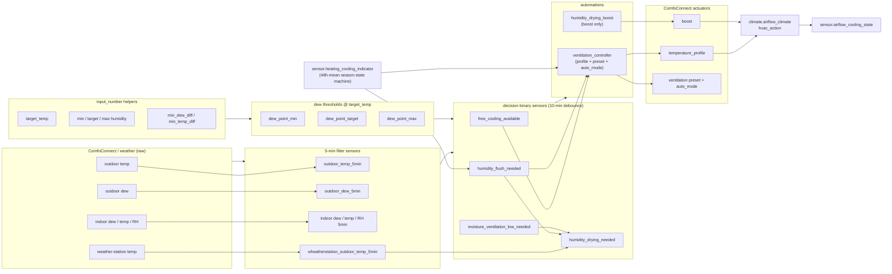
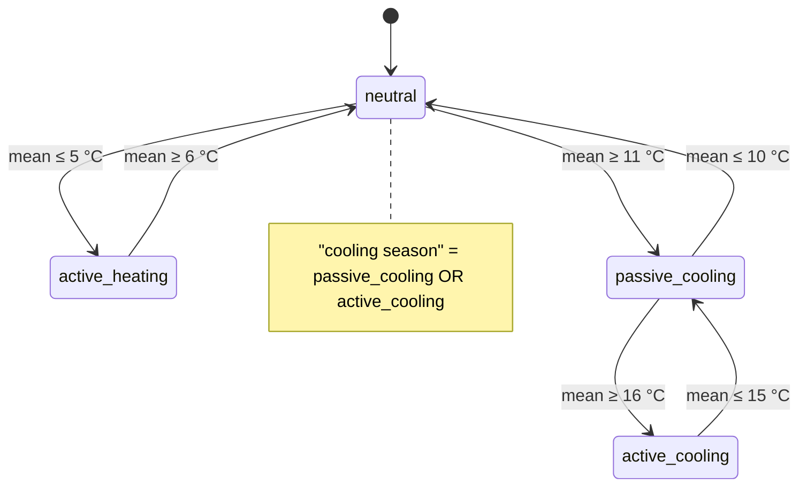
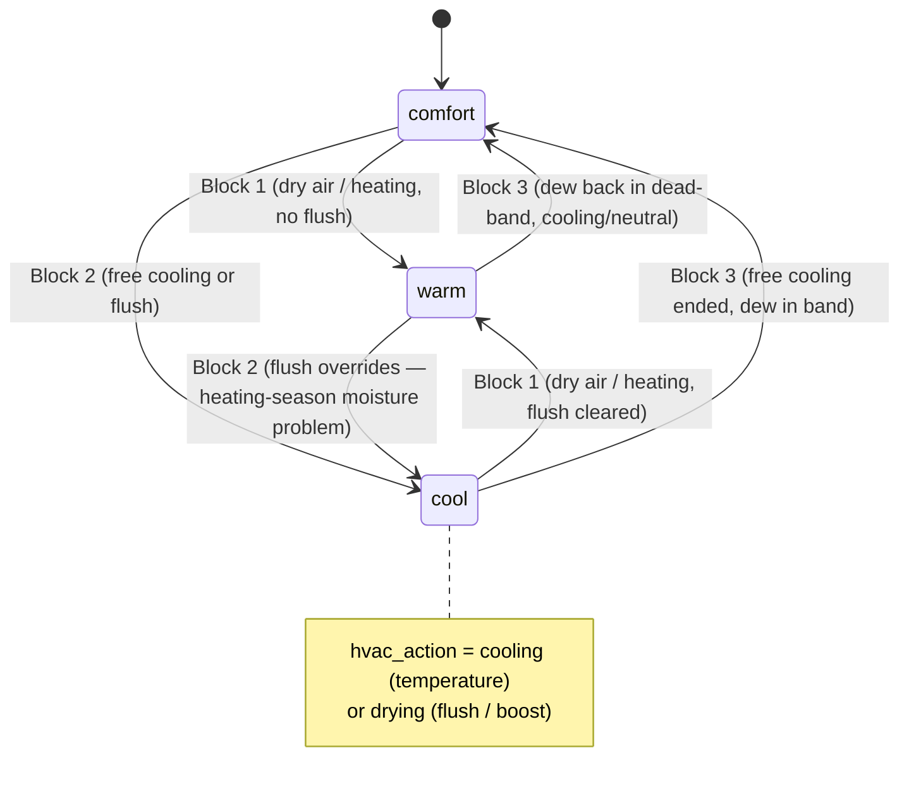
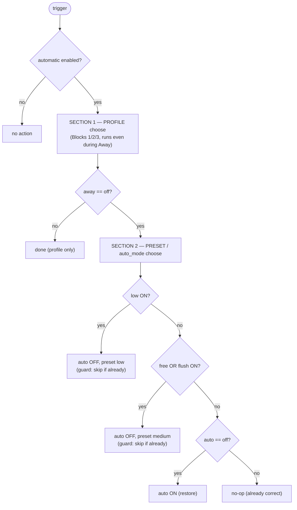
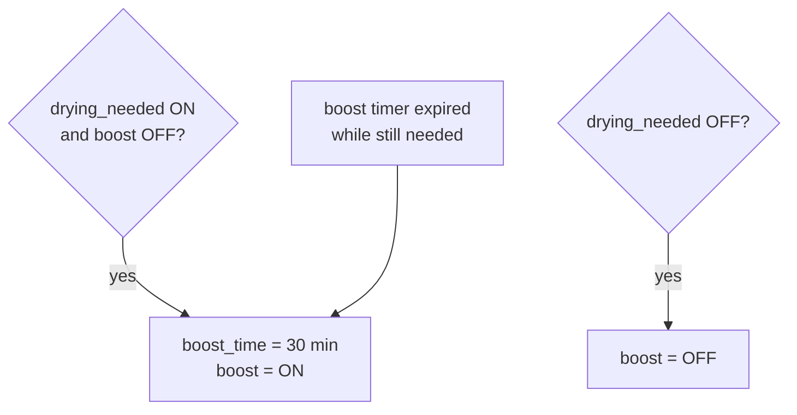
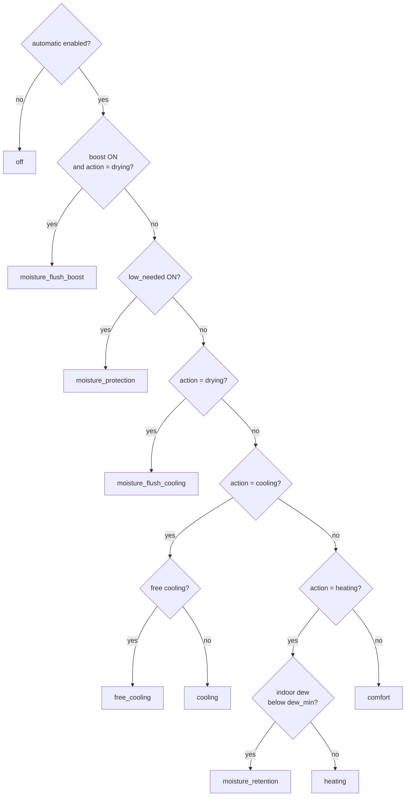

# Airflow Cooling & Humidity — Architecture Design

**Scope:** `packages/airflow_cooling.yaml` (+ `packages/heating_cooling_indicator.yaml`)
**Hardware:** Zehnder ComfoAir Q350 ERV via the ComfoConnect integration
**Status:** Living document — reflects the dew-point + dew-difference-flush design.

> Related plans: [ventilation-profile-automation.md](ventilation-profile-automation.md),
> [airflow-threshold-inputs-humidity-fallback.md](airflow-threshold-inputs-humidity-fallback.md),
> [airflow-bypass-sensor.md](airflow-bypass-sensor.md).

---

## 1. Purpose

Drive the ERV's **temperature profile** (`warm` / `comfort` / `cool`) and **ventilation level**
(auto / low / medium / boost) automatically, to:

1. **Free-cool** the house when outdoor air is cool and dry enough (open the bypass).
2. **Flush indoor moisture** when indoor air is too humid and outdoor air is drier — even when
   the target humidity can't be reached (mould / condensation safety).
3. **Protect** against importing humid outdoor air (reduce ventilation).
4. **Retain moisture** in dry winter air (keep the heat exchanger recovering).

Every humidity decision is expressed in **dew point** (absolute moisture) rather than relative
humidity, because RH thresholds drift as indoor temperature changes. All dew thresholds are
computed at the **target temperature** via the Magnus formula.

---

## 2. Entity inventory

### Inputs — filter sensors (5-min time-weighted average, throttled)

| Entity | Source | Meaning |
|---|---|---|
| `sensor.airflow_min_indoor_dew_5min` | indoor dew aggregate | **indoor moisture** |
| `sensor.airflow_avg_indoor_temp_5min` | indoor temp aggregate | indoor temperature |
| `sensor.airflow_avg_indoor_humidity_5min` | indoor RH aggregate | indoor RH (display) |
| `sensor.airflow_outdoor_dew_5min` | ComfoConnect intake | **outdoor moisture** |
| `sensor.airflow_outdoor_temp_5min` | ComfoConnect intake | **ComfoConnect outdoor temp** |
| `sensor.airflow_wheatherstation_outdoor_temp_5min` | weather station (filtered) | **real outdoor temp, smoothed** |
| supply/extract air temp+humidity | ComfoConnect | bypass estimation |

> **Two outdoor temperatures:** the ComfoConnect intake temp (`airflow_outdoor_temp_5min`) gates
> the *cool-profile* logic; the smoothed weather-station temp (`airflow_wheatherstation_outdoor_temp_5min`,
> same 5-min filter chain) gates only the *boost*. Smoothing replaces the boost sensor's old
> `delay_on` debounce — noise spikes can no longer falsely start/stop a boost.

### Derived thresholds — dew point at target temp (Magnus)

| Entity | From helper | Used as |
|---|---|---|
| `sensor.airflow_dew_point_min` | `airflow_min_humidity` | dry-air floor (moisture retention) |
| `sensor.airflow_dew_point_target` | `airflow_target_humidity` | comfort target / free-cooling ceiling |
| `sensor.airflow_dew_point_max` | `airflow_max_humidity` | moisture-problem ceiling |

### Decision binary sensors

| Entity | Fires when | Debounce |
|---|---|---|
| `binary_sensor.airflow_free_cooling_available` | outdoor cool **and** dry enough to free-cool | `delay_on`/`delay_off` 10 min |
| `binary_sensor.airflow_humidity_flush_needed` | indoor too humid **and** outdoor drier (cool-profile flush) | `delay_on`/`delay_off` 10 min |
| `binary_sensor.airflow_moisture_ventilation_low_needed` | outdoor too humid to import | `delay_on`/`delay_off` 10 min |
| `binary_sensor.airflow_humidity_drying_needed` | flush **and** weather-gated (smoothed) **and** scheduled (boost) | `delay_off` 10 min only |

> **`drying_needed` has no `delay_on`.** Its temp input is now the smoothed
> `airflow_wheatherstation_outdoor_temp_5min`, so the 5-min filter absorbs noise that `delay_on`
> used to guard against. Dropping `delay_on` cuts boost start latency by 10 min (was flush 10 +
> drying 10 = 20 min; now ~10 min). `delay_off` kept to avoid premature boost stop.

### Actuators (ComfoConnect)

`select.comfoconnect_pro_temperature_profile` (warm/comfort/cool) ·
`switch.comfoconnect_pro_boost` + `number.comfoconnect_pro_boost_time` ·
`select.comfoconnect_pro_ventilation_preset` (low/medium) + `switch.comfoconnect_pro_auto_mode`.

### Read-only views

`climate.airflow_climate` (hvac_mode + hvac_action) · `sensor.airflow_cooling_state`
(reason-based status) · `sensor.airflow_bypass_estimation`.

---

## 3. Data flow



---

## 4. Season state machine — `sensor.heating_cooling_indicator`

A Schmitt-trigger state machine over the **48-hour mean** outdoor temperature
(`sensor.wheatherstation_outdoor_temperature_48h_mean`). Wide hysteresis bands prevent the
season from flapping day-to-day. This is the **season context** consumed by the profile logic.



---

## 5. Decision sensors

### 5.1 `free_cooling_available` — temperature free cooling

All four must hold (indoor-temp uses a 0.5 °C Schmitt: ON at `target`, stays on to `target − 0.5`):

```
(outdoor_dew + min_dew_diff) < indoor_dew      # outdoor drier by a margin
AND outdoor_dew ≤ dew_point_target             # importing it won't exceed target humidity
AND outdoor_temp_5min < target − min_temp_diff # ComfoConnect intake cool enough
AND indoor_temp ≥ temp_threshold               # room warm enough to want cooling
```

### 5.2 `humidity_flush_needed` — cool-profile moisture flush

Two OR branches, both requiring a real outdoor→indoor moisture **difference**
(`margin_ok = outdoor_dew + min_dew_diff − h < indoor_dew`). A `0.3 °C` `this.state` hysteresis
(`h`) relaxes every boundary while ON.


Key asymmetry:
- **Branch 1** (indoor above max = a real problem) → flushes **regardless of temperature**.
- **Branch 2** (above target only) → flushes **only if** the ComfoConnect temp gate holds, so a
  non-urgent flush never overcools a cool room.
- In **active_heating**, only Branch 1 is allowed.

### 5.3 `moisture_ventilation_low_needed` — humid-import protection

Indoor Schmitt (`indoor_dew ≥ dew_max` ON, stays on to `dew_target`) AND
(`outdoor_dew ≥ dew_threshold` OR `outdoor_dew ≥ indoor_dew`). Broadly the inverse of free
cooling: outdoor air is too humid to bring in.

### 5.4 `humidity_drying_needed` — the noisy boost

```
flush_needed
AND NOT low_active
AND airflow_wheatherstation_outdoor_temp_5min < target_temp  # smoothed REAL outdoor, not intake
AND in_schedule                                              # workday / non-workday window
```

The cool-profile flush deliberately **ignores** the schedule and weather station; only the boost
is schedule- and weather-gated. The temp input is the **smoothed** weather-station sensor
(`| float(99)` fail-safe kept: unavailable → 99 °C → gate fails → no boost). `delay_on` removed;
`delay_off` 10 min kept (see §2 decision-sensor note).

---

## 6. Temperature profile selection — the core decision

Profile is **Section 1** of the unified `automation.airflow_ventilation_controller` (mode: queued,
see §7). Triggers: season change, `free_cooling_available`, `humidity_flush_needed`,
`moisture_ventilation_low_needed`, indoor-humidity change, HA start, plus actuator re-assert
triggers. Gated by `input_boolean.airflow_cooling_automatic_enabled`. The profile `choose:` runs
**regardless of Away** — **first matching block wins**, each block idempotent (skips if profile
already correct).


**Precedence note (heating-season flush):** in `active_heating` with indoor dew above max, both
Block 1 Case B (warm) and Block 2 (cool, via flush Branch 1) would match. Block 1 Case B carries a
`flush OFF` guard, so it **yields** — the moisture flush (cool) wins, because relieving a
mould/condensation risk outranks retaining warmth.

### Resulting profile transitions



> Every input to these blocks is a 10-min-debounced sensor (or a wide-hysteresis season state),
> so the profile cannot change more than roughly every 10 minutes.

---

## 7. Actuator automations

Two automations drive the actuators. The **controller** owns profile + preset + auto_mode
deterministically; **boost** is isolated with its own hardware-timer mechanics.

### 7.1 `airflow_ventilation_controller` (mode: queued)

One automation computes the *complete desired* ComfoConnect state from the decision sensors and
applies it **idempotently** — no two automations fight over preset/auto_mode. `queued` (not
restart) so a rapid second trigger never aborts a partial auto-off→preset apply.

Gated at automation level by `automatic_enabled == on`. Away handled **inside**: profile runs
always, preset/auto_mode only when `away == off`.



Preset priority (first match wins): **low → (free or flush) medium → restore auto on**. Service
order in low/medium: **auto_mode off first, then preset** (schedule can't override the manual
preset mid-apply).

Preset is computed **independent of `drying`/boost**. Since `drying ⊂ flush`, whenever a boost
runs the preset rule already yields medium, set *before* the boost starts; idempotent apply means
no preset write disturbs the running boost, and medium fallback is already in place when it expires.
That's why `drying_needed` is **not** a controller trigger.

### 7.2 `airflow_humidity_drying_boost` (mode: single)



Boost is the high-volume flush; re-arms itself if the ComfoConnect 30-min hardware timer expires
while drying still needed. Gated `automatic_enabled == on` + `away == off` — identical guards to
the controller, so combined state stays consistent. Boost never touches profile/preset/auto_mode;
controller never touches boost.

---

## 8. Reason-based status — `sensor.airflow_cooling_state`

A read-only **derived view** (the automations remain the source of truth). It reads the climate
`hvac_action` plus the boost/low/free sensors and resolves a single status by priority — first
match wins:



`hvac_action` itself is `drying` when a boost runs during free cooling **or** the cool profile is
flushing (`profile == cool AND flush_needed`); `cooling` for plain cool profile; `heating` for warm;
`fan` for comfort.

---

## 9. Tunable parameters

| Helper | Role |
|---|---|
| `airflow_cooling_target_temperature` | reference temp for all dew thresholds & temp gates |
| `airflow_target_humidity` | comfort dew target / free-cooling ceiling |
| `airflow_min_humidity` / `airflow_max_humidity` | dry-air floor / moisture-problem ceiling |
| `airflow_min_dew_diff` | required outdoor→indoor dew margin |
| `airflow_min_temp_diff` | required outdoor→target temp margin |
| `airflow_bypass_efficiency_max/min` | bypass-estimation calibration |
| `schedule.airflow_boost_workday` / `_non_workday` | boost time windows |

---

## 10. Anti-flip-flop mechanisms (summary)

| Mechanism | Where | Effect |
|---|---|---|
| 10-min `delay_on`/`delay_off` | free/flush/low sensors (`drying`: `delay_off` only) | caps decision rate at ~10 min |
| 5-min filter on weather temp | `wheatherstation_outdoor_temp_5min` | replaces boost `delay_on`; absorbs noise spikes |
| idempotent unified controller | preset + auto_mode | single owner, no cross-automation hand-off race |
| 0.3 °C dew hysteresis (`this.state`) | flush sensor branches | damps the flush feedback loop |
| 0.5 °C indoor-temp Schmitt | free cooling + flush temp gate | cooling can't disable its own trigger |
| dew Schmitt (target↔max) | low-vent sensor | stable humid-import boundary |
| ±0.1 °C dew epsilon | profile Blocks 1 & 2 | anti-chatter at band edges |
| wide-band 48h-mean state machine | season indicator | season changes over days, not hours |
| idempotent `choose` + dead-band | profile automation | no redundant profile writes |
| `flush OFF` guard on Block 1B | profile automation | deterministic heating-season cool-vs-warm |
| Block 4 bypass-close recovery | profile automation | drains stuck-`cool` when no owner; gated `profile==cool` so it can't oscillate vs Block 1 |

---

## 11. Complete state transition reference

Every actuator output (profile · preset/auto_mode · boost) and the derived `cooling_state`,
with the exact input conditions that produce each. Outputs decompose into four independent
sub-functions (§11.1–11.4); §11.5 is the master matrix of realistic end-to-end combinations.

**Legend.** `auto` = `automatic_enabled` · `away` = `away_function` · season ∈
{`HEAT`=active_heating, `NEUT`=neutral, `COOL`=passive/active_cooling} · `free`/`flush`/`low`/`dry`
= the four decision binary_sensors (✓ on / – off) · dew band of `indoor_dew` vs
`dew_min`/`dew_max`: `DRY`(<min) · `BAND`([min,max]) · `HUM`(>max). `keep` = no profile block
matches → previous profile retained. `(untouched)` = Section 2 skipped (Away on).

**Mutual-exclusivity invariants** (enforced in the sensors — impossible combos omitted):
`low ✓ ⇒ flush – and dry –` · `dry ⊂ flush ⇒ dry ✓ ⇒ flush ✓` · `dry ✓ ⇒ boost on` (only when
auto on + away off).

### 11.1 `hvac_action` (template climate) — first match wins

| # | profile | free | flush | boost | → action |
|---|---------|------|-------|-------|----------|
| 1 | any | ✓ | * | on | **drying** |
| 2 | cool | * | ✓ | off | **drying** |
| 3 | cool | – | – | off | **cooling** |
| 4 | warm | * | * | (not free+boost) | **heating** |
| 5 | comfort | * | * | (not free+boost) | **fan** |
| 6 | unknown/none | – | – | off | **idle** |

> Row 1 fires regardless of profile: `free + boost` ⇒ drying even under warm/comfort (rare edge).

### 11.2 `cooling_state` (derived view) — priority ladder, first match wins

| Priority | Condition | → state |
|---|---|---|
| 0 | `auto` off | **off** |
| 1 | `boost` on AND action=`drying` | **moisture_flush_boost** |
| 2 | action=`drying` | **moisture_flush_cooling** |
| 3 | `low` on | **moisture_protection** |
| 4 | action=`cooling` AND `free` on | **free_cooling** |
| 5 | action=`cooling` | **cooling** |
| 6 | action=`heating` AND `indoor_dew < dew_min` | **moisture_retention** |
| 7 | action=`heating` | **heating** |
| 8 | else (action=`fan`/`idle`) | **comfort** |

### 11.3 Profile (Section 1 `choose`) — first matching block wins, else `keep`

| Block | → profile | Conditions (all must hold) |
|---|---|---|
| 1A | **warm** | `indoor_dew < dew_min − 0.1` AND season ≠ COOL |
| 1B | **warm** | season = HEAT AND `free` – AND `flush` – |
| 2A | **cool** | `free` ✓ AND season = COOL |
| 2B | **cool** | `flush` ✓ (any season) |
| 3  | **comfort** | (season = NEUT OR (season = COOL AND `free` –)) AND `dew_min ≤ indoor_dew ≤ dew_max` |
| 4  | **comfort** | `profile == cool` AND `free` – AND `flush` – AND season ≠ HEAT (bypass-close recovery) |
| –  | **keep** | none of the above (recovery zone / already-correct / edge) |

> Runs even during Away. Each block is idempotent (skips the write if profile already correct).
> Precedence: 1A→1B→2A→2B→3→4. Heating-season moisture problem: 1B yields (its `flush –` guard) so
> 2B (cool flush) wins over warm. Block 4 drains the stuck-cool trap (out-of-band DRY/HUM with no owner).

### 11.4 Preset / auto_mode (Section 2 `choose`) — only when `away` off

| Branch | → output | Conditions |
|---|---|---|
| low | auto **off** + preset **low** | `low` ✓ |
| medium | auto **off** + preset **medium** | `low` – AND (`free` ✓ OR `flush` ✓) |
| restore | auto **on** | `low` – AND `free` – AND `flush` – (acts only if auto currently off) |
| no-op | (unchanged) | desired already satisfied |

When `away` on: Section 2 is skipped entirely → preset/auto_mode left as-is.

### 11.4b Boost (`airflow_humidity_drying_boost`) — needs `auto` on AND `away` off

| `drying` | boost switch | → action |
|---|---|---|
| ✓ | off | set boost_time 30 min, boost **on** |
| ✓ | on (timer expired) | re-arm boost **on** |
| – | on | boost **off** |
| – | off | no-op |

`drying = flush ✓ AND wheatherstation_temp_5min < target AND in_schedule`. So boost ⊂ flush ⊂ cool profile.

### 11.5 Master scenario matrix (auto on, away off unless noted)

| # | season | free | flush | low | dry | dew | → Profile | Preset/auto | Boost | action | **cooling_state** |
|---|--------|------|-------|-----|-----|-----|-----------|-------------|-------|--------|-------------------|
| H1 | HEAT | – | – | – | – | DRY | warm (1B) | auto on | off | heating | **moisture_retention** |
| H2 | HEAT | – | – | – | – | BAND | warm (1B) | auto on | off | heating | **heating** |
| H3 | HEAT | – | – | ✓ | – | HUM | warm (1B) | low | off | heating | **moisture_protection** |
| H4 | HEAT | – | ✓ | – | – | HUM | cool (2B) | medium | off | drying | **moisture_flush_cooling** |
| H5 | HEAT | – | ✓ | – | ✓ | HUM | cool (2B) | medium | on | drying | **moisture_flush_boost** |
| H6 | HEAT | ✓ | – | – | – | BAND | keep¹ | medium | off | per-keep | per-keep |
| N1 | NEUT | – | – | – | – | DRY | warm (1A) | auto on | off | heating | **moisture_retention** |
| N2 | NEUT | – | – | – | – | BAND | comfort (3) | auto on | off | fan | **comfort** |
| N3 | NEUT | – | – | ✓ | – | HUM | comfort (4) | low | off | fan | **moisture_protection** |
| N4 | NEUT | ✓ | – | – | – | BAND | comfort (3) | medium | off | fan | **comfort**² |
| N5 | NEUT | – | ✓ | – | – | HUM | cool (2B) | medium | off | drying | **moisture_flush_cooling** |
| N6 | NEUT | – | ✓ | – | ✓ | HUM | cool (2B) | medium | on | drying | **moisture_flush_boost** |
| C1 | COOL | ✓ | – | – | – | BAND | cool (2A) | medium | off | cooling | **free_cooling** |
| C2 | COOL | ✓ | ✓ | – | – | HUM | cool (2A/2B) | medium | off | drying | **moisture_flush_cooling** |
| C3 | COOL | ✓ | ✓ | – | ✓ | HUM | cool | medium | on | drying | **moisture_flush_boost** |
| C4 | COOL | – | ✓ | – | – | HUM | cool (2B) | medium | off | drying | **moisture_flush_cooling** |
| C5 | COOL | – | ✓ | – | ✓ | HUM | cool (2B) | medium | on | drying | **moisture_flush_boost** |
| C6 | COOL | – | – | – | – | BAND | comfort (3) | auto on | off | fan | **comfort** |
| C7 | COOL | – | – | – | – | DRY | comfort (4) | auto on | off | fan | **comfort** |
| C8 | COOL | – | – | ✓ | – | HUM | comfort (4) | low | off | fan | **moisture_protection** |
| S1 | any | * | * | * | * | * | (controller idle, auto off) | (idle) | off | per-actual | **off** |
| S2 | any | – | ✓ | – | n/a³ | HUM | cool (2B) | (untouched) | off³ | drying | **moisture_flush_cooling** |

**Notes:**
1. `keep` — no profile block matches; previous profile is retained. State/action follow whatever
   profile persists (`per-keep`). Remaining case: HEAT+free (H6, neither 1B nor 2A apply).
   Former `keep` traps C7/N3/C8 are now resolved by Block 4 (bypass-close recovery).
2. **N4** — free cooling is *available* in NEUT but profile stays comfort (2A needs cooling season),
   so action=`fan` ⇒ state `comfort` even though preset is bumped to medium. Free air exchange
   happens at the fan level, not via the cool profile.
3. **S2 (Away on)** — Section 1 still sets the profile; Section 2 is skipped so preset/auto_mode are
   left untouched; the boost automation's `away off` condition fails so boost is never started
   (`dry` is moot). State still derives from live actuators.
